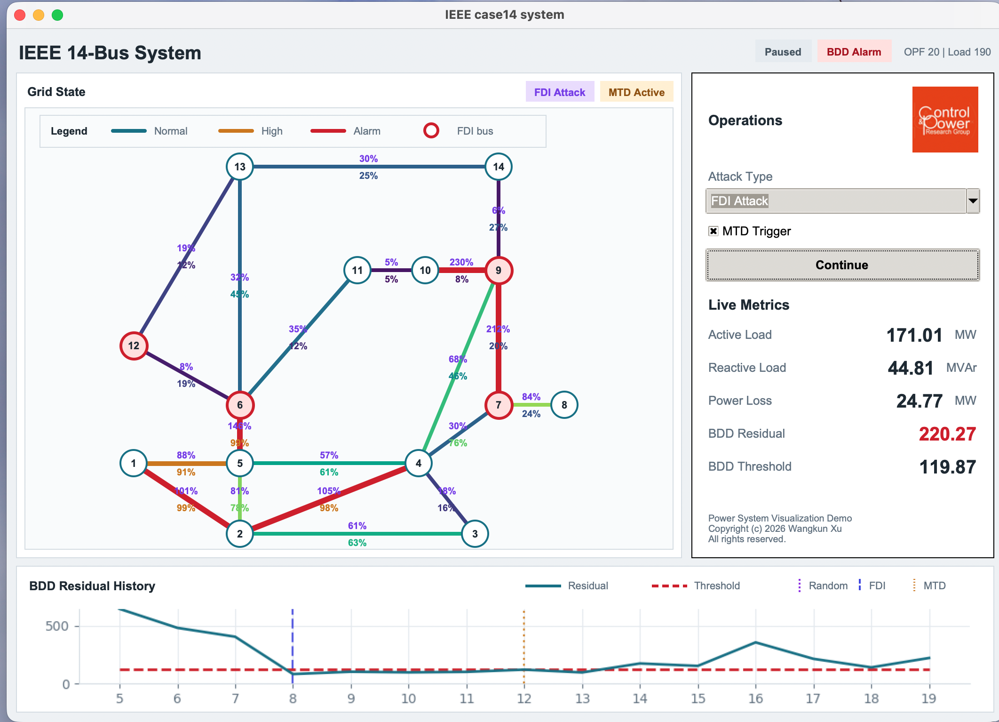

# Power System Visualization Demo: On Going



[Download/watch the MOV demo](visualization.mov)


## Introduction
This repository contains a visualization tool on power system steady state operation, e.g. Optimal Power Flow (OPF) and state estimation (SE). Meanwhile, cyber attacks, such as False Data Injection (FDI) and the corresponding defence strategy, e.g. Moving Target Defence (MTD) is also included. The demonstration is purely in Python. The power system operation replies on python package [PyPower](https://github.com/rwl/PYPOWER) (installization required)  and [Tkinter](https://docs.python.org/3/library/tkinter.html) (embedded in Python). 

This repository is part of the [**Royal Imperial Black Box (RIBB) Project**](https://ktn-uk.org/news/cyber-innovation-series-2021-22-royal-imperial-black-box-ribb/).

**Thre current functions include:**

1. Infinitely run the OPF and display the active line flow measurement (as the percentage to the line active power limits).
2. Do steady state AC state estimation and return the residual for bad data detection (BDD) usage.
3. User's choice to perform two attack types on the grid normal operation, namely 'Random Attack' and 'FDI Attack'.
4. Display both the attacked and normal measurment (as the percentage to the line active power limits) for comparison.
4. The user can trigger the MTD under the FDI attacks. The MTD will proactively change the line reactance. Therefore the attackers' grid knowledge is biased so the residual increases.
5. Display the residual plot for past OPF runs, under Normal or Attacked situation, with/out MTD triggered.

The functionalities on power system operation (e.g. opf, se, and bdd) are wrapped from our repository  [steady-state-power-system](https://github.com/xuwkk/steady-state-power-system) which maintains different algorithms to solve state estimation and detection algorithms on FDI attacks.

## Data

Please find the [Data](https://drive.google.com/drive/folders/1EhFfxk6QZOYF3TU15mcWUXg65eC_s5_e?usp=sharing) and copy it into src.

## Packages

The visualization tool only needs a small set of core packages. The current tested environment uses Python 3.10 with the packages below:

| Package | Tested version | Why it is needed |
| --- | --- | --- |
| `python` | 3.10.18 | Runtime for the demo. |
| `tk` / `tkinter` | 8.6.15 | GUI window, controls, and canvas rendering. |
| `numpy` | 2.2.6 | Matrix and vector operations for measurements, OPF outputs, and attacks. |
| `scipy` | 1.15.3 | State estimation math and chi-square bad-data detection threshold. |
| `pandas` | 2.3.3 | Loading CSV load-profile data in `gen_data.py`. |
| `matplotlib` | 3.10.9 | Embedded residual-history plot in the Tkinter interface. |
| `pillow` | 12.2.0 | Loading and resizing the CAP logo image. |
| `pypower` | 5.1.19 | IEEE test case, OPF, power-flow indexing, and power-system utilities. |

Optional development packages:

| Package | Why it is useful |
| --- | --- |
| `ipykernel` | Run notebooks such as `test_operation.ipynb`. |
| `jupyter_client` / `jupyter_core` | Notebook support if you want to inspect or prototype interactively. |

One minimal Conda setup is:

```bash
conda create -n mtd_visual -c conda-forge python=3.10 tk numpy scipy pandas matplotlib pillow pip
conda activate mtd_visual
pip install pypower
```

## PyPower

**PYPOWER** is a power flow and Optimal Power Flow (OPF) solver. It is a port of [MATPOWER](http://www.pserc.cornell.edu/matpower/) to the [Python](http://www.python.org/) programming language. Functions include:

- DC and AC (Newton's method & Fast Decoupled) power flow, and
- DC and AC optimal power flow (OPF)

## Tkinter

The **Tkinter** package (“Tk interface”) is the standard Python interface to the Tcl/Tk GUI toolkit. To learn Tkinter, please refer to one of the following tutorial:

1. [Tkinter Course - Create Graphic User Interfaces in Python Tutorial](https://www.youtube.com/watch?v=YXPyB4XeYLA&t=29s) from [freeCodeCamp.org](https://www.youtube.com/channel/UC8butISFwT-Wl7EV0hUK0BQ) (beginner level).
2. [Python Tkinter](https://www.youtube.com/playlist?list=PL6lxxT7IdTxGoHfouzEK-dFcwr_QClME_) from [John Philip Jones](https://www.youtube.com/c/johnphilipjones) (beginner level).
3. [GUIs with Tkinter](https://www.youtube.com/playlist?list=PLQVvvaa0QuDclKx-QpC9wntnURXVJqLyk) from [sentdex](https://www.youtube.com/c/sentdex) (intermidiante lavel).

## Copyright

Copyright (c) 2026 Wangkun Xu. All rights reserved.

Code derived from the linked steady-state-power-system components retains its existing provenance notices.

## Citation

For any acedemic uses please cite our paper which also uses this repo as visualization:
@article{xu2022robust,
  title={Robust moving target defence against false data injection attacks in power grids},
  author={Xu, Wangkun and Jaimoukha, Imad M and Teng, Fei},
  journal={IEEE Transactions on Information Forensics and Security},
  volume={18},
  pages={29--40},
  year={2022},
  publisher={IEEE}
}
